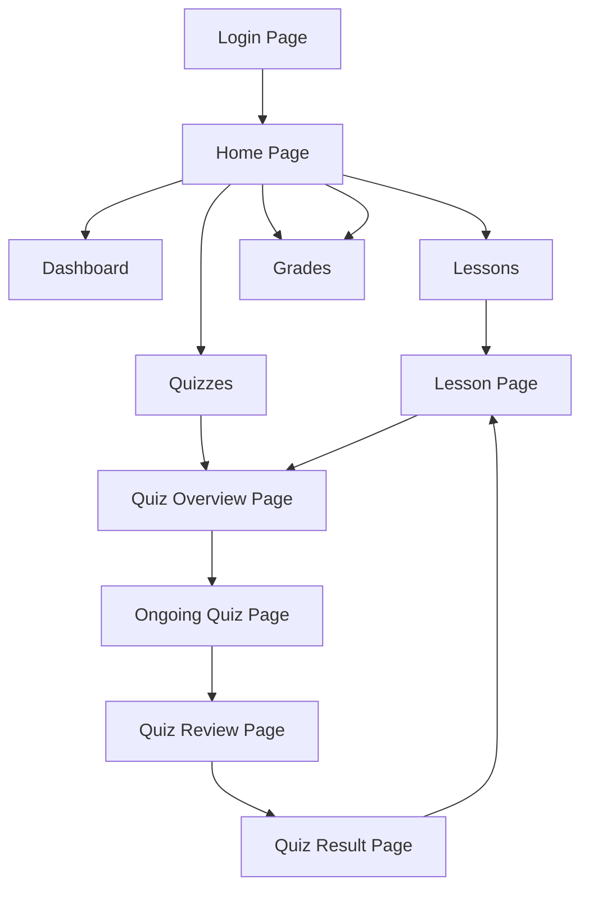
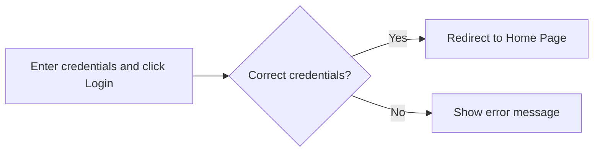

# CSS Flow Charts

The following flow charts show the CSS classes and their relationships in the
application.

## Page Hierarchy

```mermaid
graph TD
    A[Login Page] --> B[Home Page]
    B --> C[Dashboard]
    B --> D[Lessons]
    B --> E[Quizzes]
    B --> F[Grades]
    B --> F[Grades]
    D-->G[Lesson Page]
    E-->H[Quiz Overview Page]
    G-->H
    H-->I[Ongoing Quiz Page]
    I-->J[Quiz Review Page]
    J-->K[Quiz Result Page]
    K-->G
```

## Login Flow

```mermaid
graph LR
    A[Enter credentials and click Login] --> B{Correct credentials?}
    B -- Yes --> C[Redirect to Home Page]
    B -- No --> D[Show error message]
```
