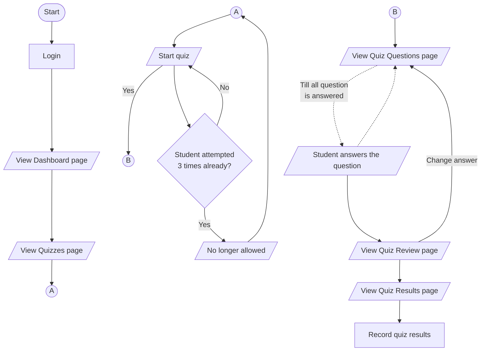

# Quiz Feature

This document describes the quiz feature how to take a quiz and view quiz results.

## Overview

The quiz feature contains features that allow students to take quizzes. Ideally, this should contain the following features:

- [x] A list of quizzes
- [x] A quiz viewer (Overview)
- [x] Quiz questions viewer:
  - [x] Single answer question
  - [x] Multiple answer question
  - [x] Grouping question
  - [x] Sequencing question
- [x] A quiz results viewer
- [x] Record quiz results (User quiz attempts)

## How to take a quiz

The flow of the quiz feature is as follows:

1. The student logs in to the dashboard (Considered logged in).
2. The student navigates to the quizzes page.
3. The student is presented with a list of quizzes.
4. The student clicks on a quiz.
5. The student is presented with the quiz overview.
   - The student can see the quiz title, description, and the number of questions, number of attempts taken and the passing score.
   - The student can only attempt the quiz 3 times.
   - Students will be blocked to take the quiz after 3 attempts but can still see the Quiz overview.
   - Students can retake the quiz even if they have already passed the quiz up to 3 times.
6. The student can start the quiz and will be asked to confirm.
   - Once the student confirms, the user quiz attempt will be recorded as an attempt regardless of the student's completion of the quiz.
7. The student is presented with the quiz questions.
8. The student can answer the quiz questions.
9. The student will be asked to proceed to review questions page.
10. The student can review the quiz questions and go back to the quiz questions if they need to change their answers.
11. The student can submit the quiz.
12. The student will be presented with the quiz results.

> - Please note that the quiz flow has connectors `A` and `B` to indicate the flow of the quiz.
> - The diagram above was simplified (removed the backend server responsibilities) to focus on the user flow.
