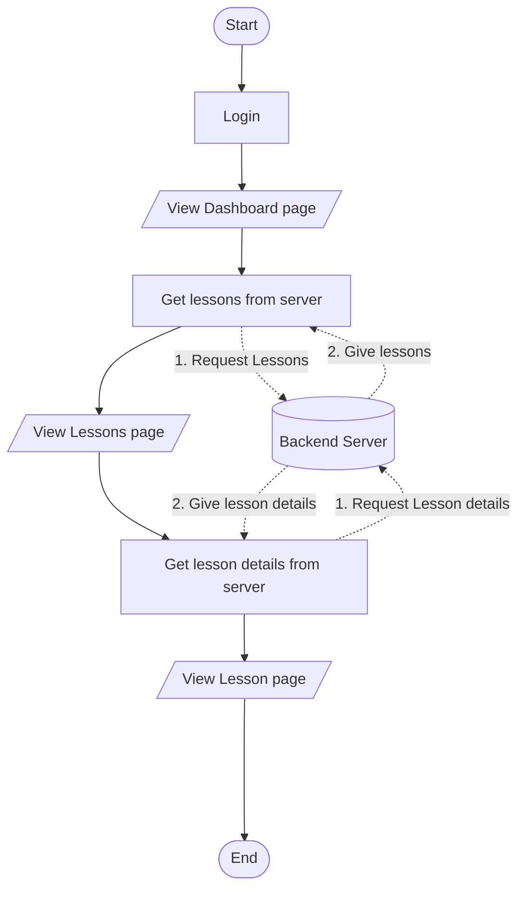

# Lessons Feature

This document describes the lessons feature how to view lessons page and lesson in the CSS lesson page.

## Overview

The CSS lessons contains features that allow students to view lessons. Ideally, this should contain the following features:

- [x] A list of lessons
- [x] A lesson viewer
- [ ] A file viewer for lesson files

## Flow chart

The flow of the lessons feature is as follows:

1. The student logs in to the dashboard.
2. The student navigates to the lessons page.
3. The student is presented with a list of lessons.
4. The student clicks on a lesson.
5. The student is presented with the lesson viewer.
6. The student can view the lesson content.
7. The student can optionally view the lesson files.
8. The student can navigate to the related quizzes.

