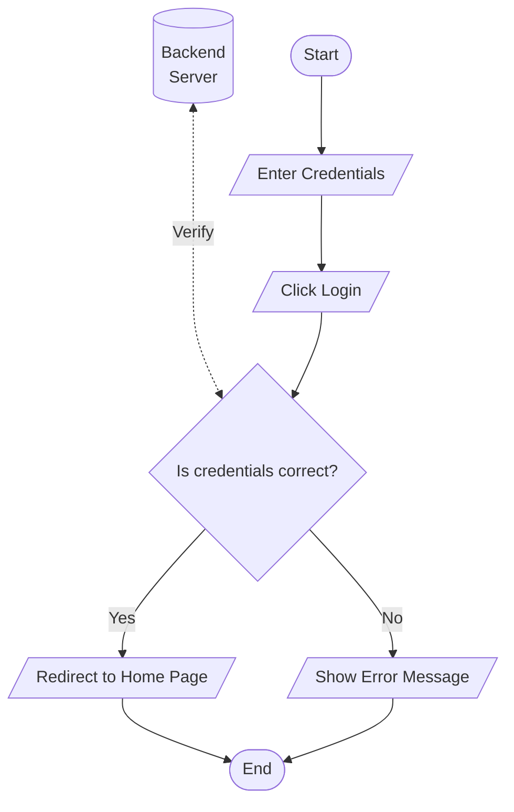
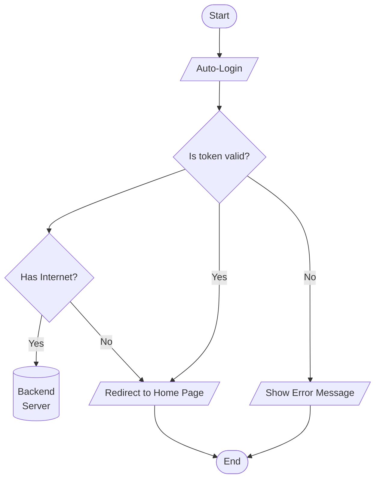

# Login Flow

This document describes the flow of the login feature. There are two process of logging in:

- Normal login (username and password credentials)
- Auto-login (using an existing token from previous login)

## Logging in (Normal Login)

When using the app for the first time. It is required to have an internet connection to verify the credentials. Doing so ensures that the user is a valid student and has access to the app including the lessons, quizzes, and confidential information such as own grades.

> This will also allow the app to cache all the necessary data for offline use such as the lesson content, quiz questions, and grades (if already applicable).

## Logging in (Auto-Login)

When the user has already logged in before, the app will automatically log in the user using the token stored in the device. This is useful for users who have already logged in before and have not logged out of the app.

However if the user has been deleted from the server or the token is no longer valid, and the user has no internet connection, the app will redirect the dashboard page regardless and still allow the user to view the cached data. This is because we have no way to verify the user's credentials without an internet connection.

But do note that the user requests will fail to upload not only because it is offline but because the user is not authenticated. This is to prevent unauthorized access to the server. Meaning the user can do request such as viewing the cached lesson, cached quizzes and submit quiz answers, but the server will not accept the request to upload the user's quiz results.
